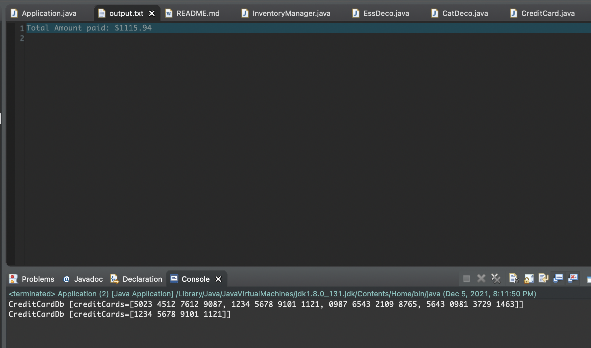

# Individual Project
## Aniruddha Arun Narkhede
### Problem Statement
Design and implement a Java application for the following requirements. You may choose up to 3 design patterns. Include a class diagram for your design. All submissions should be committed to the assigned Github repo. Please include a README file with instructions on how to build and run your application.

Requirements:

The application should maintain an internal, static database (inventory of stock)  (this may be developed using HashMaps and/or other  built-in Java Data structures). This means once we re-run the program, the changes to the data would not persist. We will provide the data that has to be maintained. The data will contain the following tables and fields:
(Sample input file and sample data set for the inventory would be provided separately)
Table 1: Items
Category (Essentials, Luxury, Miscellaneous)
Item for each category (Essentials - Clothes, soap, milk; Luxury - perfume, chocolates; Misc - Bedsheets, footwear)
The available Quantity of each item
Price of each item
Table 2: Cards
Card Numbers
2. Input CSV file will contain an order including Items, Quantity needed, and the payment card number.
3. Input file should be processed as follows:
Validate if the requested quantity for each item is permissible. For example, if the request is to order 3 soaps, check the database if we have at least 3 soaps in our inventory.
There will be a cap on the quantity of each category that can be ordered in one single order. For example, restrict Essentials to a maximum of 3, Luxury to 4, and Misc to 6. (This will be configured beforehand)
In case it is an incorrect request, generate and output TXT file with message "Please correct quantities." and include the items with incorrect quantities
After this validation, if the cart is valid, calculate prices for the cart.
Take the card number of the user and if it is not present in DB add it.
Output the CSV list with the total amount paid.

### Steps to run project:
#### Pre-requisite: Java 8
1. Clone git repository 'https://github.com/gopinathsjsu/individual-project-anirud55.git'
2. Open the project in any IDE (Preferable Eclipse)
3. Copy new input.csv and dataset.csv in resources folder
4. Navigate to src/com.lafacon/Application.java
5. Update line# 17 {dataset.csv file path} with new dataset file path
6. Update line# 18 {input.csv file path} with new input file path
7. Save Application.java and run as Java Application
8. Upon successful execution open output file under resources folder
9. Observe the result in output.txt

### Design patterns Used:
Singleton: Singleton is a creational design pattern that let me ensure that a class has only one instance, while providing a global access point to this instance. I have used Singleton design pattern to design InventoryManager class.

Strategy: Strategy is a behavioral design pattern that let me define a family of algorithms, put each of them into a separate class, and make their objects interchangeable. In the checkout functionality, I have used strategy pattern to distinguish between valid order and invalid order and using the class as per designed strategy.

Decorator: Decorator is a structural design pattern that let me attach new behaviors to objects by placing these objects inside special wrapper objects that contain the behaviors. For this case, I am using decorator pattern to decorate the Categories using 3 different decorators i.e. Essentials, Luxury and Misc to add the  quantities

### Class Diagram

### Output
1. Input1.csv

2. Input2.csv

3. Input3.csv

